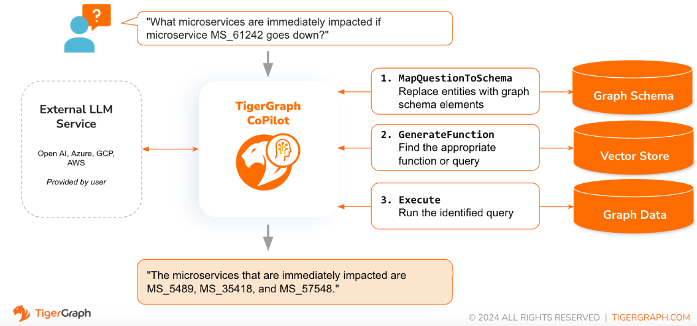
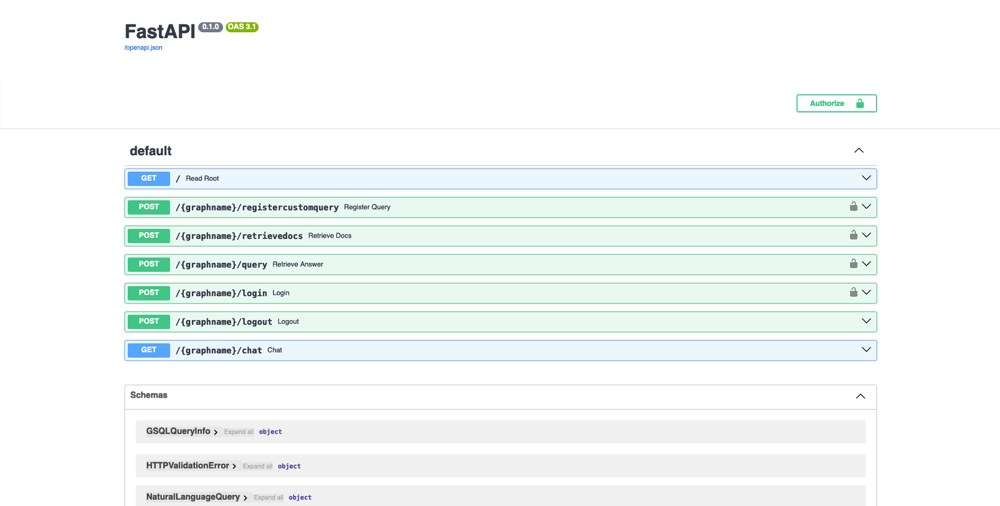
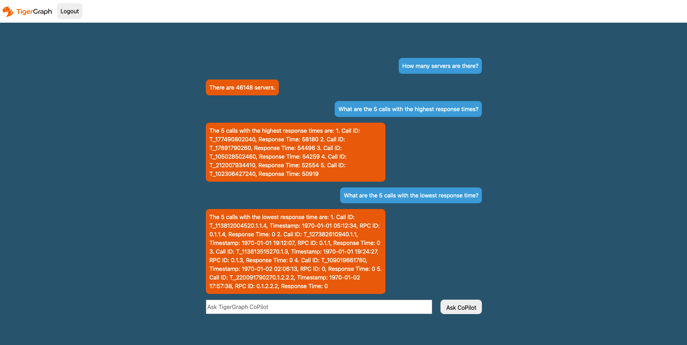

# TigerGraph CoPilot

## Releases
* **3/18/2024: CoPilot is available now in Alpha** (v0.0.1). It uses a Large Language Model (LLM) to convert your question into a function call, which is then executed on the graph in TigerGraph. We would love to hear your feedback to keep improving it so that it could bring more value to you. If you are trying it out, it would be helpful if you could fill out this [sign up form](https://info.tigergraph.com/copilotalpha) so we can keep track of it (no spam, promised). And if you would just like to provide the feedback, please feel free to fill out this [short survey](https://forms.gle/c9jd4evjEPsVtR5p7) after you have played with CoPilot. Thank you for your interest and support!

## Overview
TigerGraph CoPilot is a natural language query service that allows users to ask questions about their graph data in plain English. The service uses a Large Language Model (LLM) to convert the user's question into a function call, which is then executed on the graph database. The service is designed to be easily extensible, allowing for the addition of new LLM providers and graph schemas. TigerGraph CoPilot consists of 3 components, InquiryAI (available now), SupportAI (available Q2 2024), and QueryAI (available Q4 2024). 


## InquiryAI
InquiryAI is the first component of TigerGraph CoPilot. It is a natural language query service that allows users to ask questions about their graph data in plain English. The service uses a Large Language Model (LLM) to convert the user's question into a function call, which is then executed on the graph database. The service is designed to be easily extensible, allowing for the addition of new LLM providers and LangChain tools. InquiryAI is available now in alpha.

### InquiryAI Architecture


InquiryAI leverages a Large Language Model (LLM) to convert a user's question into a function call, which is then executed on the graph database. In order to do this, InquiryAI uses an AI agent that has two tools available to it: `MapQuestionToSchema` and `GenerateFunction`. 

The `MapQuestionToSchema` tool maps the user's question to the graph schema. 

The `GenerateFunction` tool generates a function call based on the user's question and the graph schema. The function is then executed on the graph database, then the result is processed by the LLM service and returned to the user. `GenerateFunction` utilizes a vector RAG (Retrieval-Augmented Generation) process to suggest the most relevant functions to the user's question. **Currently, the vector store used by `GenerateFunction` is ephemeral, meaning that the available queries will not be persisted when the container is shut off. If the container dies, the desired queries available to the CoPilot service will have to be re-registered.** 

### InquiryAI Roadmap
InquiryAI is currently in alpha and is being actively developed. The roadmap for InquiryAI is as follows:

* **February 2024**: InquiryAI alpha is released, with support for OpenAI, GCP, and Azure hosted models. The service is packaged as a Docker container and is available via GitHub. To store the available queries and function calls, an ephemeral vector store (FAISS) is used. This means the available queries will not be persisted when the container is shut off. Support for LangChain and pyTigerGraph interaction with the CoPilot service is also available.

* **March 2024**: InquiryAI will support the ability to connect with AWS hosted LLMs. LlamaIndex integration will begin. 

* **April 2024**: InquiryAI will move into beta stage. A persistent vector store will be implemented, allowing for the storage of available queries and function calls.

* **May 2024 +**: The InquiryAI will support continous conversations, and the agent will be aware of previous questions and answers. Integration with common open-source models such as Llama and Mistral will be performed. InquiryAI will be available on TigerGraph Cloud by July 2024.

## SupportAI
SupportAI is the second component of TigerGraph CoPilot. It is designed to ingest a set of documents, extract a knowledge graph from the information, and enable hybrid search of the documents and graph data through natural language queries. This functionality will enrich RAG (Retrieval-Augmented Generation) pipelines with graph data, enabling more accurate and informative responses to user queries. SupportAI is under active development and will be publicly released in alpha in Q2 2024. If you are interested in evaluating at its current phase, please contact us at ml@tigergraph.com.

## QueryAI
QueryAI is the third component of TigerGraph CoPilot. It is designed to be used as a developer tool to help generate graph queries in GSQL from an English language description. This will enable developers to write GSQL queries more quickly and accurately, and will be especially useful for those who are new to GSQL. QueryAI is available in alpha Q4 2024.

# Getting Started

## Docker Pull the CoPilot Image and Setup Environment
```sh
docker pull tigergraphml/copilot

cd ~ && mkdir -p CoPilot/configs

touch CoPilot/configs/db_config.json CoPilot/configs/llm_config.json CoPilot/configs/milvus_config.json
```

## Alternative: Clone the Repository, Setup Environment, and Build the Dockerfile
```sh
git clone https://github.com/tigergraph/CoPilot.git

cd CoPilot && mkdir configs

touch configs/db_config.json configs/llm_config.json configs/milvus_config.json

docker build -t copilot:0.1 .
```

### Optional: Configure Logging Level in Dockerfile
To configure the logging level of the service, edit the `Dockerfile`. By default, the logging level is set to `"INFO"`.

```dockerfile
ENV LOGLEVEL="INFO"
```
This line can be changed to support different logging levels. The levels are described below:

* **CRITICAL**: A serious error
* **ERROR**: Failing to perform functions
* **WARNING**: Indication of unexpected problems, e.g. failure to map a user's question to the graph schema
* **INFO**: Confriming that the service is performing as expected.
* **DEBUG**: Detailed information, e.g. the functions retrieved during the GenerateFunction step, etc.
* **DEBUG_PII**: Finer-grained information that could potentially include PII, such as a user's question, the complete function call (with parameters), and the LLM's natural language response.
* **NOTSET**: All messages are processed

## Create LLM provider configuration file
In the `configs/llm_config.json` file, copy your provider's JSON config template below, and fill out the appropriate fields.

### OpenAI
In addition to the `OPENAI_API_KEY`, `llm_model` and `model_name` can be edited to match your specific configuration details.

```json
{
    "model_name": "GPT-4",
    "embedding_service": {
        "embedding_model_service": "openai",
        "authentication_configuration": {
            "OPENAI_API_KEY": "YOUR_OPENAI_API_KEY_HERE"
        }
    },
    "completion_service": {
        "llm_service": "openai",
        "llm_model": "gpt-4-0613",
        "authentication_configuration": {
            "OPENAI_API_KEY": "YOUR_OPENAI_API_KEY_HERE"
        },
        "model_kwargs": {
            "temperature": 0
        },
        "prompt_path": "./app/prompts/openai_gpt4/"
    }
}
```
### GCP
Follow the GCP authentication information found here: https://cloud.google.com/docs/authentication/application-default-credentials#GAC and create a Service Account with VertexAI credentials. Then add the following to the docker run command:

```sh
-v $(pwd)/configs/SERVICE_ACCOUNT_CREDS.json:/SERVICE_ACCOUNT_CREDS.json -e GOOGLE_APPLICATION_CREDENTIALS=/SERVICE_ACCOUNT_CREDS.json
```

And your JSON config should follow as:

```json
{
    "model_name": "GCP-text-bison",
    "embedding_service": {
        "embedding_model_service": "vertexai",
        "authentication_configuration": {}
    },
    "completion_service": {
        "llm_service": "vertexai",
        "llm_model": "text-bison",
        "model_kwargs": {
            "temperature": 0
        },
        "prompt_path": "./app/prompts/gcp_vertexai_palm/"
    }
}
```

### Azure
In addition to the `AZURE_OPENAI_ENDPOINT`, `AZURE_OPENAI_API_KEY`, and `azure_deployment`, `llm_model` and `model_name` can be edited to match your specific configuration details.
```json
{
    "model_name": "GPT35Turbo",
    "embedding_service": {
        "embedding_model_service": "azure",
        "azure_deployment":"YOUR_EMBEDDING_DEPLOYMENT_HERE",
        "authentication_configuration": {
            "OPENAI_API_TYPE": "azure",
            "OPENAI_API_VERSION": "2022-12-01",
            "AZURE_OPENAI_ENDPOINT": "YOUR_AZURE_ENDPOINT_HERE",
            "AZURE_OPENAI_API_KEY": "YOUR_AZURE_API_KEY_HERE"
        }
    },
    "completion_service": {
        "llm_service": "azure",
        "azure_deployment": "YOUR_COMPLETION_DEPLOYMENT_HERE",
        "openai_api_version": "2023-07-01-preview",
        "llm_model": "gpt-35-turbo-instruct",
        "authentication_configuration": {
            "OPENAI_API_TYPE": "azure",
            "AZURE_OPENAI_ENDPOINT": "YOUR_AZURE_ENDPOINT_HERE",
            "AZURE_OPENAI_API_KEY": "YOUR_AZURE_API_KEY_HERE"
        },
        "model_kwargs": {
            "temperature": 0
        },
        "prompt_path": "./app/prompts/azure_open_ai_gpt35_turbo_instruct/"
    }
}
```

### AWS Bedrock
```json{
    "model_name": "Claude-3-haiku",
    "embedding_service": {
        "embedding_model_service": "bedrock",
        "embedding_model":"amazon.titan-embed-text-v1",
        "authentication_configuration": {
            "AWS_ACCESS_KEY_ID": "ACCESS_KEY",
            "AWS_SECRET_ACCESS_KEY": "SECRET"
        }
    },
    "completion_service": {
        "llm_service": "bedrock",
        "llm_model": "anthropic.claude-3-haiku-20240307-v1:0",
        "authentication_configuration": {
            "AWS_ACCESS_KEY_ID": "ACCESS_KEY",
            "AWS_SECRET_ACCESS_KEY": "SECRET"
        },
        "model_kwargs": {
            "temperature": 0,
        },
        "prompt_path": "./app/prompts/aws_bedrock_claude3haiku/"
    }
}
```
## Create DB configuration file
Copy the below into `configs/db_config.json` and edit the `hostname` and `getToken` fields to match your database's configuration. Set the timeout, memory threshold, and thread limit parameters as desired to control how much of the database's resources are consumed when answering a question.

If you are running TigerGraph outside of docker compose, change the hostname to match its address (`http://localhost`, `https://your-TgCloud-hostname`). Once authentication is enabled in TigerGraph, set getToken to `true`.

You can also disable the consistency_checker, which reconciles Milvus and TigerGraph data, within this config.  It is true by default
```json
{
    "hostname": "http://tigergraph",
    "getToken": false,
    "default_timeout": 300,
    "default_mem_threshold": 5000,
    "default_thread_limit": 8,
    "enable_consistency_checker": true
}
```

## Create Milvus configuration file (optional)
Note:  Milvus is not necessary for deployment or development currently. Copy the below into `configs/milvus_config.json` and edit the `host` and `port` fields to match your Milvus configuration (keeping in mind docker configuration).  `username` and `password` can also be configured below if required by your Milvus setup.  enabled="true" means use Milvus as the embedding store, enabled="false" means use FAISS - This will be removed eventually.
```json
{
    "host": "milvus-standalone",
    "port": 19530,
    "username": "",
    "password": "",
    "enabled": "true"
}
```

## Create log configuration file (optional)
Copy the below into `configs/log_config.json` and edit the appropriate values to suit your needs.  The log rotation is based on size and backups are kept.  These configurations are applied in the LogWriter to the standard python logging package.  Operational and audit logs are recorded.  Outputs include log.ERROR, log.INFO, and log.AUDIT-COPILOT
```json
{
    "log_file_path": "logs",
    "log_max_size": 10485760,
    "log_backup_count": 10
}
```

## Run the Docker Image
```sh
docker run -d -v $(pwd)/configs/llm_config.json:/llm_config.json -v $(pwd)/configs/db_config.json:/db_config.json --name copilot -p 80:80 tigergraphml/copilot:latest
```

# Using TigerGraph CoPilot
There are five ways to interact with the TigerGraph CoPilot service: through the Swagger documentation page, through the pyTigerGraph client, through the LangChain client, or through the REST API.

## Authentication
There are two options to authenticate with the service. First is an username/password pair generated from the TigerGraph database. The second is a GSQL secret, also obtained from the database. However, when using the GSQL secret, the username field must be specified as `__GSQL__secret`, with the password field containing the secret. If pyTigerGraph is being used and a connection is created with the `gsqlSecret` parameter, this will already be done for you.

## Swagger Doc Page
Navigate to `http://localhost/docs` when the Docker container is running.


## Chat with the CoPilot
Navigate to `http://localhost/graphname/chat` when the Docker container is running, where graphname is the name of the graph you want to query.


## Using pyTigerGraph
First, update pyTigerGraph to utilize the latest build:
```sh
pip install -U git+https://github.com/tigergraph/pyTigerGraph.git
```

Then, the endpoints are availble when configured with a `TigerGraphConnection`:

```py
from pyTigerGraph import TigerGraphConnection

# create a connection to the database
conn = TigerGraphConnection(host="DATABASE_HOST_HERE", graphname="GRAPH_NAME_HERE", username="USERNAME_HERE", password="PASSWORD_HERE")

### ==== CONFIGURE INQUIRYAI HOST ====
conn.ai.configureInquiryAIHost("INQUIRYAI_HOST_HERE")

### ==== RETRIEVE TOP-K DOCS FROM LIBRARY ====
# `top_k` parameter optional
conn.ai.retrieveDocs("How many papers are there?", top_k = 5)

### ==== RUN A NATURAL LANGUAGE QUERY ====
print(conn.ai.query("How many papers are there?"))

# prints: {'natural_language_response': 'There are 736389 papers.', 'answered_question': True, 'query_sources': {'function_call': "getVertexCount('Paper')", 'result': 736389}}

### ==== REGISTER A CUSTOM QUERY ====
# Prompt for PageRank query - could be read in as JSON file.
pr_prompt = {
    "function_header": "tg_pagerank",
    "description": "Determines the importance or influence of each vertex based on its connections to other vertices.",
    "docstring": "The PageRank algorithm measures the influence of each vertex on every other vertex. PageRank influence is defined recursively: a vertex’s influence is based on the influence of the vertices which refer to it. A vertex’s influence tends to increase if either of these conditions are met:\n* It has more referring vertices\n* Its referring vertices have higher influence\nTo run this algorithm, use `runInstalledQuery('tg_pagerank', params={'v_type': 'INSERT_V_TYPE_HERE', 'e_type': 'INSERT_E_TYPE_HERE', 'top_k': INSERT_TOP_K_HERE})`, where the parameters are:\n* 'v_type': The vertex type to run the algorithm on.\n* 'e_type': The edge type to run the algorithm on.\n* 'top_k': The number of top scoring vertices to return to the user.",
    "param_types": {
        "v_type": "str",
        "e_type": "str",
        "top_k": "int"
    }
}

# Register Query
conn.ai.registerCustomQuery(pr_prompt["function_header"], pr_prompt["description"], pr_prompt["docstring"], pr_prompt["param_types"])

# Run Query
print(conn.ai.query("What are the 5 most influential papers by citations?"))

# prints: {'natural_language_response': 'The top 5 most cited papers are:\n\n1. [Title of paper with Vertex_ID 428523]\n2. [Title of paper with Vertex_ID 384889]\n3. [Title of paper with Vertex_ID 377502]\n4. [Title of paper with Vertex_ID 61855]\n5. [Title of paper with Vertex_ID 416200]', 'answered_question': True, 'query_sources': {'function_call': "runInstalledQuery('tg_pagerank', params={'v_type': 'Paper', 'e_type': 'CITES', 'top_k': 5})", 'result': [{'@@top_scores_heap': [{'Vertex_ID': '428523', 'score': 392.8731}, {'Vertex_ID': '384889', 'score': 251.8021}, {'Vertex_ID': '377502', 'score': 149.1018}, {'Vertex_ID': '61855', 'score': 129.7406}, {'Vertex_ID': '416200', 'score': 129.2286}]}]}}
```

## Using LangChain
To use LangChain with InquiryAI, first install the LangChain fork here in your Python environment:
```
pip install git+https://github.com/langchain-ai/langchain.git
```
Then, you can get answers from the graph with the below:

```py
import pyTigerGraph as tg
conn = tg.TigerGraphConnection(host="DATABASE_HOST_HERE", graphname="GRAPH_NAME_HERE", username="USERNAME_HERE", password="PASSWORD_HERE")

### ==== CONFIGURE INQUIRYAI HOST ====
conn.ai.configureInquiryAIHost("INQUIRYAI_HOST_HERE")

from langchain_community.graphs import TigerGraph
graph = TigerGraph(conn)
result = graph.query("How many servers are there?")
print(result)
# {'natural_language_response': 'There are 46148 servers.', 
#  'answered_question': True,
#  'query_sources': {'function_call': 'getVertexCount(vertexType="BareMetalNode")', 
#                    'result': 46148}
```

## Using the REST API
The REST API can be used to interact with the service. The endpoints can be found on the Swagger documentation page.

# Customization and Extensibility
TigerGraph CoPilot is designed to be easily extensible. The service can be configured to use different LLM providers, different graph schemas, and different LangChain tools. The service can also be extended to use different embedding services, different LLM generation services, and different LangChain tools. For more information on how to extend the service, see the [Developer Guide](./docs/DeveloperGuide.md).

# Testing

## Test in Docker Container (Easiest)

If you want to use Weights And Biases, your API key needs to be set in an environment variable on the host machine. 

```sh
export WANDB_API_KEY=KEY HERE
```

Make sure that all your LLM service provider configuration files are working properly. The configs will be mounted for the container to access.

```sh
docker build -f Dockerfile.tests -t copilot-tests:0.1 .

docker run -d -v $(pwd)/configs/:/ -e GOOGLE_APPLICATION_CREDENTIALS=/GOOGLE_SERVICE_ACCOUNT_CREDS.json -e WANDB_API_KEY=$WANDB_API_KEY -it --name copilot-tests copilot-tests:0.1


docker exec copilot-tests bash -c "conda run --no-capture-output -n py39 ./run_tests.sh all all"
```

## Running Locally
```sh
docker-compose -f ./docker-compose.yml up -d --build
```

## Test Script Options

To edit what tests are executed, one can pass arguments to the `./run_tests.sh` script. Currently, one can configure what LLM service to use (defaults to all), what schemas to test against (defaults to all), and whether or not to use Weights and Biases for logging (defaults to true). Instructions of the options are found below:

### Configure LLM Service
The first parameter to `run_tests.sh` is what LLMs to test against. Defaults to `all`. The options are:

* `all` - run tests against all LLMs
* `azure_gpt35` - run tests against GPT-3.5 hosted on Azure
* `openai_gpt35` - run tests against GPT-3.5 hosted on OpenAI
* `openai_gpt4` - run tests on GPT-4 hosted on OpenAI
* `gcp_textbison` - run tests on text-bison hosted on GCP

### Configure Testing Graphs
The second parameter to `run_tests.sh` is what graphs to test against. Defaults to `all`. The options are:

* `all` - run tests against all available graphs
* `OGB_MAG` - The academic paper dataset provided by: https://ogb.stanford.edu/docs/nodeprop/#ogbn-mag.
* `DigtialInfra` - Digital infrastructure digital twin dataset
* `Synthea` - Synthetic health dataset

### Configure Weights and Biases
If you wish to log the test results to Weights and Biases (and have the correct credentials setup above), the final parameter to `run_tests.sh` automatically defaults to true. If you wish to disable Weights and Biases logging, use `false`.


### Add Your Own Test Suite
To add a new InquiryAI test suite to TigerGraph CoPilot, read the documentation [here](./docs/DeveloperGuide.md#adding-a-new-test-suite).

# Contributing
If you would like to contribute to TigerGraph CoPilot, please read the documentation [here](./docs/Contributing.md).
